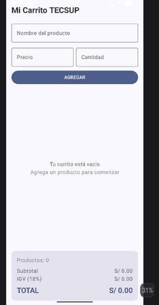
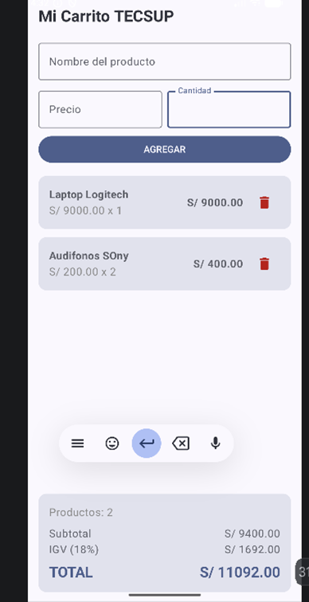

# Lab04CarritoTecsup

**Autor:** Sheila Aguirre  
**Curso:** Programación en Móviles  — TECSUP

---

## Descripción

Aplicación de carrito de compras desarrollada en **Android con Jetpack Compose**. Esta solución integra:
* El modelo de datos `Producto` (*Lab 02*).
* El formulario de ingreso (*Lab 03*).
* Una `LazyColumn` interactiva que permite **agregar** y **eliminar** elementos dinámicamente.
* Cálculo automático e inmediato de **Subtotal**, **IGV (18%)** y **Total**.

---

## Capturas de Pantalla
Lista vacia:

Lista con Productos:

##  Preguntas Conceptuales

### 1. ¿Por qué `mutableStateListOf` y no una `MutableList` normal?
`mutableStateListOf` es una estructura de datos observable por el runtime de Jetpack Compose. Cuando agregas o eliminas un elemento, Compose detecta el cambio automáticamente y **recompone** únicamente la sección afectada de la interfaz gráfica. Una `MutableList` tradicional modifica los datos en memoria pero no notifica a la UI, por lo que la pantalla no se actualizaría sola.

### 2. ¿Por qué la lista se declara con `val`?
Porque la palabra clave `val` en Kotlin asegura que la **referencia** del objeto no cambie, mas no impide que su **contenido interno** cambie. Métodos como `.add()` y `.remove()` alteran los elementos dentro del objeto `SnapshotStateList` existente sin reasignarle una nueva instancia, lo cual respeta la regla de inmutabilidad de la variable `val`.

### 3. ¿Qué hace `weight(1f)` en la `LazyColumn`?
El modificador `weight(1f)` indica que la `LazyColumn` debe extenderse y ocupar todo el espacio vertical disponible dentro del contenedor principal (`Column`). Esto empuja el panel de totales hacia la parte inferior de la pantalla, manteniéndolo fijo abajo sin importar cuántos productos estén listados.