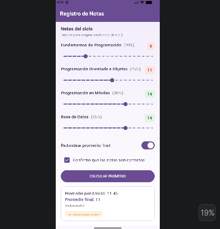

Registro de Notas — Jetpack Compose (Semana 3)
Descripción

Aplicación Android desarrollada en Jetpack Compose que calcula el promedio ponderado de 4 cursos de programación, cada uno con un peso distinto. La app permite asignar notas mediante controles deslizantes, confirmar los datos antes de calcular, y muestra una observación automática según el resultado final.

El ejercicio tiene como objetivo practicar el uso de controles interactivos nuevos en Compose (Slider, Switch, Checkbox) siguiendo el mismo patrón de estado (remember más by) ya utilizado con TextField.

Funcionalidad implementada

Barra superior con título y fondo degradado.

Cuatro filas de curso, cada una con nombre y peso del curso, un Slider para asignar la nota de 0 a 20 en valores enteros, y un badge que muestra la nota en vivo con efecto semáforo, rojo si es menor a 13 y verde si es 13 o más.

Switch para activar o desactivar el redondeo del promedio final.

Checkbox de confirmación que habilita el botón de cálculo.

Botón CALCULAR PROMEDIO, deshabilitado hasta marcar la confirmación.

Tarjeta de resultado con el promedio ponderado en 2 decimales, el promedio final redondeado o no según el Switch, y la observación EXCELENTE, APROBADO, EN RECUPERACIÓN o DESAPROBADO en un chip de color.

Mensaje de confirmación y pie de página fijo con la autoría.

Tecnologías y conceptos utilizados

Kotlin

Jetpack Compose con Material 3

Controles Slider, Switch, Checkbox y Button

Manejo de estado con remember, mutableStateOf y el delegado by

Expresión when para la lógica condicional de la observación y el color del chip

Función roundToInt de Kotlin para el redondeo del promedio

Diseño con Brush.verticalGradient para el fondo

Reglas de negocio

Los pesos de los cursos son fijos: Fundamentos de Programación 20 por ciento, Programación Orientada a Objetos 25 por ciento, Programación en Móviles 30 por ciento y Base de Datos 25 por ciento.

El promedio ponderado se calcula como nota1 por 0.20 más nota2 por 0.25 más nota3 por 0.30 más nota4 por 0.25.

La observación según el promedio final sigue estos rangos: de 17 a 20 es EXCELENTE, de 13 a 16.99 es APROBADO, de 10 a 12.99 es EN RECUPERACIÓN, y menor a 10 es DESAPROBADO.

Salida en el emulador
