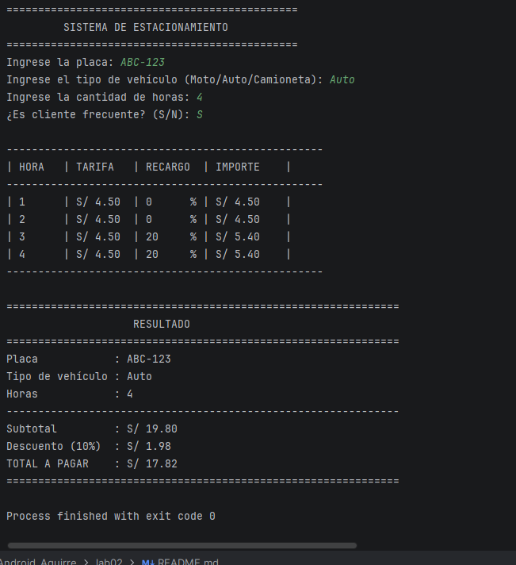

# Sistema de Estacionamiento

## Problemática

Un estacionamiento necesita un sistema que permita calcular de manera sencilla el monto que debe pagar cada vehículo según el tiempo que permanece dentro del establecimiento.

Actualmente, realizar estos cálculos manualmente puede generar errores al aplicar las diferentes tarifas, recargos y descuentos. Por este motivo, se plantea desarrollar un programa en Kotlin que permita ingresar los datos del vehículo y obtener automáticamente el monto final a pagar.

## Descripción de la solución

El programa permite registrar la placa del vehículo, su tipo, la cantidad de horas que permaneció estacionado y si el cliente es frecuente.

A partir de estos datos, el sistema determina la tarifa correspondiente y realiza los cálculos necesarios para obtener el total a pagar.

La solución está desarrollada en un solo archivo Kotlin y utiliza condicionales para controlar las diferentes reglas del ejercicio.

## Datos de entrada

El sistema solicita:

Placa del vehículo.
Tipo de vehículo.
Cantidad de horas estacionado.
Si el cliente es frecuente.

## Tipos de vehículos y tarifas

| Tipo de vehículo | Tarifa por hora |
|------------------|-----------------|
| Moto             | S/ 2.00         |
| Auto             | S/ 4.50         |
| Camioneta        | S/ 10.00        |

## Reglas del sistema

El cálculo del estacionamiento considera las siguientes reglas:

Si el vehículo permanece hasta 2 horas, no se aplica ningún recargo.
Si permanece más de 2 horas y hasta 5 horas, se aplica un recargo del 20%.
Si permanece más de 5 horas, se aplica un recargo del 50%.
Si el cliente es frecuente, se aplica un descuento del 10%.
La cantidad mínima de permanencia es de 1 hora.
Si se ingresa un tipo de vehículo no válido, el sistema muestra un mensaje de error.

## Cálculo

Primero se obtiene el importe inicial multiplicando la tarifa del vehículo por la cantidad de horas.

Luego se aplica el recargo correspondiente según las horas de permanencia.

Después, si el cliente es frecuente, se aplica el descuento del 10%.

Finalmente, se obtiene el total que debe pagar el cliente.

### Ejemplo

Para un vehículo tipo **Auto**, con **4 horas** de permanencia y siendo **cliente frecuente**:

textTarifa por hora: S/ 4.50

Importe inicial:
4.50 × 4 = S/ 18.00

Recargo del 20%:
18.00 × 0.20 = S/ 3.60

Subtotal:
18.00 + 3.60 = S/ 21.60

Descuento del 10%:
21.60 × 0.10 = S/ 2.16

Total:
21.60 - 2.16 = S/ 19.44

##PROMPT USADO
Desarrolla un programa en Kotlin para resolver un ejercicio de sistema de estacionamiento.

El programa debe permitir ingresar la placa del vehículo, el tipo de vehículo (Moto, Auto o Camioneta), la cantidad de horas de permanencia y si el cliente es frecuente.

Las tarifas son:
Moto: S/ 2.00 por hora.
Auto: S/ 4.50 por hora.
Camioneta: S/ 10.00 por hora.

El programa debe aplicar las siguientes reglas:
Hasta 2 horas no se aplica recargo.
Más de 2 y hasta 5 horas se aplica un recargo del 20%.
Más de 5 horas se aplica un recargo del 50%.
Si el cliente es frecuente se aplica un descuento del 10%.
No se permite registrar menos de 1 hora.
Se debe validar que el tipo de vehículo sea válido.

El programa debe estar desarrollado completamente en un solo archivo Kotlin y utilizar condicionales if/else. No utilizar arrays, listas, colecciones ni múltiples clases.

El resultado debe mostrarse en la consola de manera ordenada mediante una tabla que muestre la placa, tipo de vehículo, horas, recargo y total a pagar.

Mantener el código en un nivel básico/intermedio, sencillo de comprender para un estudiante.

##SALIDA DE CONSOLA ¿