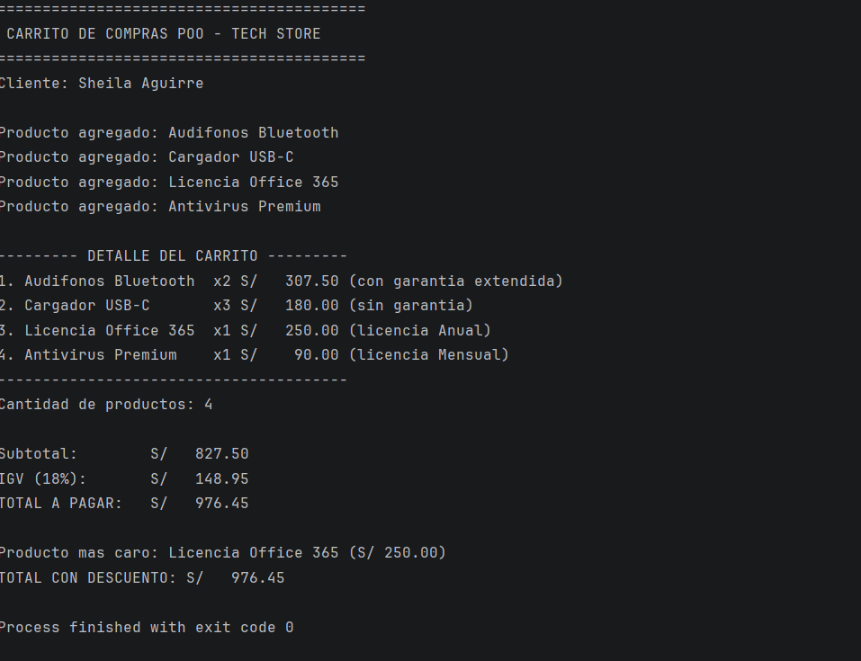

# Carrito de Compras POO - Lab02 (Kotlin)

**Estudiante:** Sheila Aguirre
**Asignatura:** Programación en Móviles - 4to Ciclo
**Profesor:** Juan León Suiyon

## Descripción
Versión orientada a objetos de un carrito de compras para una tienda de tecnología, aplicando los 4 pilares de la POO en Kotlin:

- **Abstracción:** `Producto` es una clase abstracta que define las propiedades comunes (`nombre`, `precio`, `cantidad`) y el método abstracto `calcularImporte()`.
- **Herencia:** `Accesorio` y `Software` heredan de `Producto`, reutilizando sus propiedades base y agregando atributos propios (`tieneGarantia`, `tipoLicencia`).
- **Polimorfismo:** cada subclase sobrescribe `calcularImporte()` y `mostrarInfo()` con lógica distinta (los accesorios pueden tener recargo por garantía, el software no).
- **Encapsulamiento:** la clase `TiendaCarrito` mantiene la lista de productos como `private`, exponiendo solo métodos públicos para interactuar con ella.

## Estructura del proyecto
- `Producto.kt` — clase abstracta base
- `Accesorio.kt` — hereda de Producto, agrega garantía
- `Software.kt` — hereda de Producto, agrega tipo de licencia
- `TiendaCarrito.kt` — encapsula la lista de productos y la lógica del carrito
- `MainTiendaPOO.kt` — punto de entrada, arma el carrito y muestra el reporte

## Estructura del prompt usado con IA
1. Se solicitó identificar las clases necesarias para modelar un carrito de compras aplicando los 4 pilares de la POO en Kotlin.
2. Se pidió el código de forma incremental: clase abstracta → subclases con herencia → sobrescritura de métodos (polimorfismo) → clase contenedora con encapsulamiento → función main de integración.
3. Se solicitó dividir la entrega en 6 commits, uno por cada avance funcional del proyecto.

## Prompt usado (resumen)
"Necesito un carrito de compras en Kotlin orientado a objetos para una tienda de tecnología, con una clase abstracta Producto, subclases Accesorio y Software que hereden de ella, sobrescritura de métodos para polimorfismo, y una clase TiendaCarrito con encapsulamiento (lista privada con métodos públicos). Debe dividirse en 6 commits y mantener la lógica de cálculo del carrito (subtotal, IGV 18%, descuento con when, producto más caro)."

## Captura de la consola final
