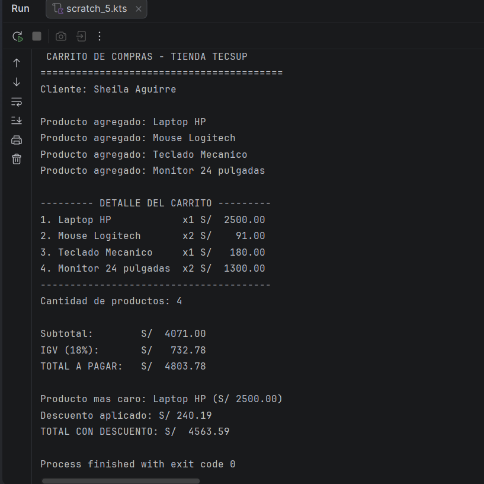

# Carrito de Compras - Lab02 (Kotlin)

**Estudiante:** Sheila Aguirre
**Asignatura:** Programación en Móviles - 4to Ciclo
**Profesor:** Juan León Suiyon

## ¿Qué hace este programa?
Es una aplicación de consola desarrollada en Kotlin que simula el proceso de compra en una tienda. El programa permite:

1. Registrar productos con nombre, precio y cantidad mediante una `data class`.
2. Calcular automáticamente el subtotal de la compra, el IGV (18%) y el monto total a pagar.
3. Mostrar un listado detallado de los productos con las columnas alineadas (usando `String.format`).
4. Identificar cuál es el producto de mayor precio dentro del carrito, con `maxByOrNull`.
5. Aplicar un descuento según el monto total de la compra, evaluado con una estructura `when`: 5% si el total supera S/ 3000, y 10% si supera S/ 5000.

## Captura final del programa

## ¿Por qué nombre y precio son val, y cantidad es var?
Los campos `nombre` y `precio` se definieron como `val` porque representan características propias del producto que no deberían modificarse una vez creado el objeto. En cambio, `cantidad` se declaró como `var` porque sí es un valor que puede variar durante la ejecución del programa, por ejemplo cuando el cliente aumenta o reduce las unidades que desea comprar.

Si se intentara reasignar el valor de `precio` después de haber creado el producto, Kotlin generaría un error de compilación, ya que las propiedades declaradas con `val` son de solo lectura y no cuentan con un método `setter` que permita modificarlas.